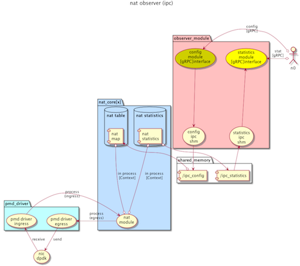

natlibs
=======

IPC library for communication between nat_core on DPDK module and its observer (monitoring module).




## statistics information
Statistics collected by nat:dpdk (transferred bytes, count, dropped packet bytes, count, NAT table size, error count including ICMP checksum errors, etc.) are notified to the monitoring module via shared memory. The monitoring module has a gRPC protocol interface and provides statistics data notification service to clients in various languages.

## nat table configurable
Static NAT records can be injected into nat:dpdk via shared memory. Like the statistics information service, it has a gRPC protocol interface and provides static NAT record configuration service to clients in various languages.


# dependency

Written in C++. The interface is a C++ class.


```bash
$ ldd ./libnatipc.so
	linux-vdso.so.1 (0x00007fff81a64000)
	libpthread.so.0 => /lib/x86_64-linux-gnu/libpthread.so.0 (0x00007fa3b43e1000)
	librt.so.1 => /lib/x86_64-linux-gnu/librt.so.1 (0x00007fa3b41d9000)
	libstdc++.so.6 => /usr/lib/x86_64-linux-gnu/libstdc++.so.6 (0x00007fa3b3e4b000)
	libgcc_s.so.1 => /lib/x86_64-linux-gnu/libgcc_s.so.1 (0x00007fa3b3c33000)
	libc.so.6 => /lib/x86_64-linux-gnu/libc.so.6 (0x00007fa3b3842000)
	/lib64/ld-linux-x86-64.so.2 (0x00007fa3b4805000)
	libm.so.6 => /lib/x86_64-linux-gnu/libm.so.6 (0x00007fa3b34a4000)
```

# compile/link install test

```
mkdir ./build
cd ./build
cmake ..
make
make install
make test
```


# usage

## parent process

```c
#include "nat_shared_memory_config.hh"
....

U128 data[4] = {{0,1},{2,3},{4,5},{6,7},};

// parent process
nat::SharedMemoryConfig  sc("/ipc_test_key", nat::SharedMemoryBase::PARENT);
sc.Update(data,4);
```

## child process
```c
#include "nat_shared_memory_config.hh"
....

U128 data[4];
bzero(data, sizeof(data));

// child process
nat::SharedMemoryConfig  sc("/ipc_test_key", nat::SharedMemoryBase::CHILD);
sc.Read(data, 4);
```


# license
This software is released under the MIT License, see LICENSE.
